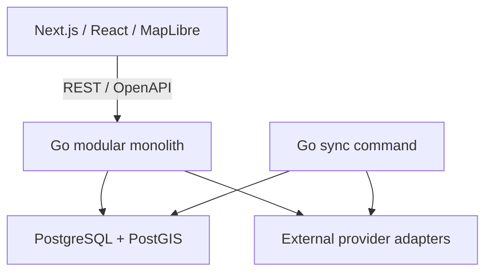

# Architecture overview

**State:** approved baseline direction; not an implemented system. Decisions are recorded in [ADRs](../adr/README.md).

The frontend supports public country content and client-side globe interactions. The Go backend owns domain rules, authorization, normalization, external integrations and bounded concurrent aggregation. PostgreSQL is the primary system of record, including cached snapshots. PostGIS solves geographic storage/queries; MapLibre solves rendering.

Separate canonical world data, dynamic intelligence, editorial knowledge and personal user data. Avoid distributed infrastructure and additional databases without a demonstrated problem.

## Target repository layout

- apps/web: Next.js frontend.
- api/cmd/server and api/cmd/sync; api/internal: Go binaries and domain modules.
- db/migrations, db/queries, db/seeds: explicit SQL and database lifecycle.
- data/geography and data/travel-knowledge: sourced/versioned datasets.
- openapi/openapi.yaml: incremental HTTP contract.
- docs/product, architecture, adr, data-sources, research, security: maintained documentation.
- infra/docker and infra/compose.yaml: development/runtime infrastructure.
- scripts and .github/workflows: necessary automation and CI.

Create directories when they contain useful deliverables. Initial backend modules are auth, world, intelligence, providers, users, visits, trips and platform, introduced as needed. Later travelknowledge, memories, media and community follow actual milestones.

Initial deployment favours same-origin web/API behind HTTPS and a reverse proxy, with one PostgreSQL/PostGIS database. Hosting vendor and object storage are deferred.
